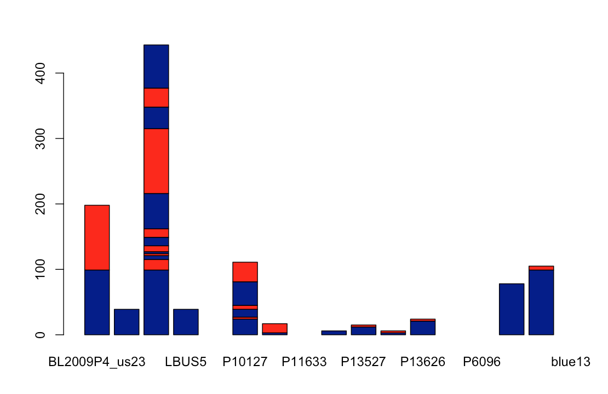

```{r setup, include = FALSE}
knitr::opts_chunk$set(
  collapse = TRUE,
  comment = "#>"
)
```

Vslyzr is a variant visualization package that provides graphical visualization for VCF files.  

## Input
* Variant data
* dna DNAbin object
* gff gff format data.frame
* vcf vcfR object

## Output
* Visualizations of the variants with a histogram

## Dependencies
vcfR, graphics, ggplot2, VariantTools

## Installation
````
library(devtools)
install_github("deusbajaj/vslyzr")
library(vslyzr)
````

## Example workflow
````
library(Vslyzr)
#Load the dataset
load("./data/vslyzr_example.rdata")

#Creates an object of class chromR from variant data
chrom <- create.chromR('sc50', seq=dna, vcf=vcf, ann=gff)
chrom <- masker(chrom)
elems <- extract.gt(chrom, element="GQ", as.numeric=TRUE)

#Plot the numeric matrix from the VCF file.
varbarplot(elems)

# running the shiny app
runvslyzrApp()
````

## Example visualization

